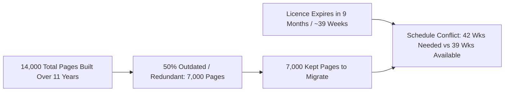

# Business Requirements Document (BRD)
## Project WikiMove – Migrating a Company Knowledge Base to a New Platform

**Document Identifier:** WM-BRD-1.0  
**Project Name:** WikiMove  
**Course:** Software Engineering & Project Management  
**Academic Term:** Final Academic Submission  
**Student Name:** [Student Name / ID Placeholder]  
**Institution:** [Department of Computer Science & Engineering / University Placeholder]  
**Date:** Academic Term 2026  
**Status:** Approved for Academic Submission  

---

### Document Control & Version History

| Version | Date | Author / Role | Status / Changes |
| :--- | :--- | :--- | :--- |
| 0.1 | Week 2 | Business Analyst / Technical Writer | Initial Draft & Problem Statement Ingestion |
| 0.5 | Week 4 | Requirements Engineer | Integrated 12 Team Capacity Model & Triage Rules |
| 1.0 | Week 8 | Project Lead | Final Baseline for Academic Evaluation |

---

### 1. Executive Summary

This Business Requirements Document (BRD) establishes the comprehensive operational, organizational, and functional requirements for **Project WikiMove**. Over 11 years of continuous software development, the organization’s internal wiki has expanded unmanaged to **14,000 pages**. Approximately 50% of these pages are outdated, redundant, or orphaned. The legacy platform’s enterprise software licence expires irrevocably in **9 months (~39 weeks)**, creating a critical operational deadline.

The Chief Technology Officer (CTO) has mandated a complete migration to a modern knowledge management platform. The initiative must clean up obsolete documentation, transfer valuable knowledge assets, and institute enforceable content custody so that the new knowledge repository does not decay. This document details the business needs, stakeholder responsibilities, capacity constraints, business requirements, and operational rules governing the proposed system.

---

### 2. Business Background & Problem Genesis

The organization operates 12 cross-functional engineering teams supported by shared corporate and technical writers. Over 11 years:
1. **Lack of Lifecycle Management:** Documentation was continually created across sprints but never retired, archived, or systematically audited.
2. **Orphaned Content:** Key engineers left the company or transitioned between squads without transferring page ownership. Consequently, thousands of pages have no active human custodian.
3. **Decaying Accuracy:** Software architectures, APIs, deployment scripts, and credentials evolved, leaving obsolete and misleading documentation in the legacy wiki.
4. **The Licence Deadline Crisis:** The legacy platform licence expires in **9 months**. Renewing the legacy platform is financially unviable and opposes the company's technical strategy.

---

### 3. Core Business Need & Objectives

#### 3.1 Business Need
The organization requires a structured, tool-assisted migration methodology to inventory all 14,000 legacy pages, coordinate triage across 12 distributed engineering teams, migrate 7,000 verified pages to the target platform, validate link integrity, and enforce ongoing custody.

#### 3.2 Primary Business Objectives
1. **BO-01: 100% Page Triage:** Complete review of all 14,000 pages to classify each as Keep, Archive, or Delete.
2. **BO-02: Quality-Gated Migration:** Migrate exactly the 50% retained pages (7,000 pages) without carrying forward obsolete or redundant material.
3. **BO-03: Zero Orphan Policy:** Bind 100% of migrated pages to a named, active human content owner.
4. **BO-04: Link & Search Integrity:** Ensure zero broken relative links (NFR-01) and full search index discoverability (NFR-02) post-migration.
5. **BO-05: Licence Deadline Containment:** Manage the 3-week schedule gap between the 42-week baseline duration and the 39-week licence expiration.
6. **BO-06: Sustainable Post-Migration Governance:** Enforce periodic 90-day owner revalidation to prevent documentation decay.

---

### 4. Stakeholder Analysis

| Stakeholder Role | Domain / Function | Key Responsibilities & Interests | Available Capacity |
| :--- | :--- | :--- | :--- |
| **Chief Technology Officer (CTO)** | Executive Sponsor | Strategic oversight, budget approval, organizational mandate enforcement. | Strategic reviews |
| **Technical Writer (Lead)** | Project Leadership | Sole dedicated project owner, triage coordinator, quality controller, orphan resolver. | **3 person-days / week** |
| **12 Engineering Teams** | Content Authors / Evaluators | Domain triage (Keep/Archive/Delete) of subsystem documentation and API specifications. | **1 person-day / week each** (12 p-d/wk total) |
| **Content Owners** | Long-Term Custodians | Designated engineers who take legal and technical accountability for migrated pages. | Embedded in team allocation |
| **QA / Test Engineer** | Quality Assurance | Verification of link integrity, search indexing, defect tracking, and regression testing. | Project-allocated |
| **Project Manager** | Governance & PM | Schedule tracking, Gantt maintenance, critical path analysis, RMMM execution. | Project-allocated |

---

### 5. Existing Situation vs. Proposed Solution

| Operational Dimension | Existing Situation (Legacy Platform) | Proposed Solution (WikiMove &amp; Target Platform) |
| :--- | :--- | :--- |
| **Total Inventory** | 14,000 pages accumulated over 11 years | Cleaned inventory: 7,000 kept pages migrated |
| **Content Accuracy** | ~50% outdated, inaccurate, or redundant | 100% curated, current, and verified content |
| **Content Ownership** | Thousands of orphaned pages with departed owners | Mandatory named human owner bound to every page |
| **Governance** | Unmanaged growth, zero periodic reviews | Automated 90-day periodic revalidation cycle |
| **Licence Urgency** | Expires in 9 months (~39 weeks) | Fully offboarded before decommission deadline |
| **Discoverability** | Fragmented search, dead links, obsolete tags | Modern search indexing, automated link validation |

---

### 6. Project Scope

#### 6.1 In-Scope
- Ingestion and cataloging of all 14,000 legacy wiki pages.
- Automated allocation of pages to the 12 engineering teams by subsystem tag.
- Triage workflow supporting Keep, Archive, and Delete classifications.
- Content owner designation interface with active employee directory validation.
- Batch migration tracking for the 7,000 retained pages at 25 pages/person-day.
- Post-migration URL rewrite mapping and link integrity checking.
- Search keyword and discoverability verification.
- Schedule gap monitoring (42 weeks baseline vs. 39 weeks licence).
- Post-migration governance dashboard enforcing 90-day recertification.

#### 6.2 Out-of-Scope (Academic & System Boundaries)
- Direct real-time migration backend or live production database operations (per academic guidelines).
- Production modification of live corporate authentication or SSO providers.
- Creation of new corporate wiki articles outside the scope of triage and migration.
- Long-term archiving hardware procurement (covered under existing corporate storage).

---

### 7. Business Requirements

#### BR-01: Wiki Page Inventory & Ingestion
The system shall ingest and maintain a centralized catalog of all 14,000 legacy wiki pages, recording Page ID, Title, URL, Creation Date, Last Modified Date, Subsystem Tag, and Legacy Author.

#### BR-02: Work Allocation & Team Quotas
The system shall partition pages across the 12 engineering teams based on technical domain, enforcing a weekly tracking quota corresponding to each team's 1 person-day per week commitment.

#### BR-03: Tri-State Triage Workflow
The system shall provide a standardized review mechanism allowing reviewers to evaluate pages at the benchmark rate of 40 pages per person-day and classify each page into one of three distinct terminal states:
- **KEEP:** Content is accurate, actively used, and required on the new platform.
- **ARCHIVE:** Content is obsolete for active development but must be preserved for historical, legal, or compliance reasons.
- **DELETE:** Content is obsolete, duplicative, or transient notes with zero organizational value.

#### BR-04: Mandatory Content Ownership Custody
The system shall mandate that any page designated as `KEEP` must have an active, named employee assigned as Content Owner prior to approving the page for migration.

#### BR-05: Migration Batching & Velocity Tracking
The system shall organize kept pages (target: 7,000 pages) into sprint migration batches and track throughput against the benchmark migration rate of 25 pages per person-day.

#### BR-06: Link Integrity Verification
The system shall verify all internal hyperlinks within migrated pages, ensuring that intra-wiki links to kept pages are updated to new target URLs, links to archived pages point to cold storage stubs, and obsolete links are flagged.

#### BR-07: Search Discoverability Verification
The system shall certify that migrated pages are indexed correctly in the new platform's search engine and surface in top query results for core technical keywords.

#### BR-08: Schedule & Licence Expiry Containment
The system shall track project burn-down against the 39-week licence expiration milestone, alerting project management when baseline progress exceeds the deadline.

#### BR-09: Risk Management & RMMM Triggers
The system shall log and rank all project risks using Exposure ($E = P \times I$), maintaining active mitigation workflows for top-ranked risks (R2, R1, R3).

#### BR-10: Post-Migration Governance Cycle
The system shall automate a 90-day periodic revalidation workflow prompting content owners to certify page accuracy or flag pages for retirement.

#### BR-11: Executive KPI Reporting
The system shall provide real-time reporting to the CTO, Project Manager, and Technical Writer showing overall triage completion %, migration completion %, defect density, and orphan counts.

#### BR-12: Complete Audit Logging
The system shall maintain an immutable audit trail capturing who performed every triage classification, owner change, or migration approval, along with timestamps.

---

### 8. Business Rules

| Rule ID | Name | Operational Rule Definition |
| :--- | :--- | :--- |
| **BRUL-01** | **Orphan Prohibition** | No page shall transition to `Migrated` status without a validated, active named employee recorded as `Content Owner`. |
| **BRUL-02** | **Irreversible Deletion Safeguard** | Any page marked `DELETE` must undergo a 14-day soft-delete grace period before permanent purge. |
| **BRUL-03** | **Archival Preservation** | Pages designated as `ARCHIVE` must be exported in read-only format to cold storage with historical metadata retained. |
| **BRUL-04** | **Benchmark Review Rate** | Triage schedules shall calculate capacity assuming exactly **40 pages per person-day**. |
| **BRUL-05** | **Benchmark Migration Rate** | Migration schedules shall calculate capacity assuming exactly **25 pages per person-day**. |
| **BRUL-06** | **Retention Ratio Baseline** | Project forecasting models shall assume exactly **50% of pages are kept** (7,000 pages). |
| **BRUL-07** | **Strict Capacity Ceiling** | Maximum weekly project capacity is fixed at **15 person-days per week** (3 TW + 12 Teams × 1). |
| **BRUL-08** | **90-Day Ownership Expiry** | Any page not recertified by its owner within 90 days of notification shall be escalated to the domain Engineering Lead. |

---

### 9. MoSCoW Prioritization Matrix

| Category | Requirement IDs | Justification |
| :--- | :--- | :--- |
| **Must Have (M)** | BR-01, BR-02, BR-03, BR-04, BR-05, BR-06, BR-08 | Absolute prerequisites to offboarding the legacy platform before licence expiry. |
| **Should Have (S)** | BR-07, BR-09, BR-10, BR-11 | Essential for quality assurance, search discovery, and long-term wiki sustainability. |
| **Could Have (C)** | BR-12, Automated content similarity duplicate detection | Highly valuable for efficiency but non-blocking for baseline cutover. |
| **Won't Have (W)** | Real-time automated translation, live collaborative WYSIWYG editor | Excluded from academic project scope; handled by commercial platforms. |

---

### 10. Success & Acceptance Criteria

1. **SC-01:** 100% of the 14,000 legacy pages are triaged into Keep, Archive, or Delete before week 24.
2. **SC-02:** Exactly 7,000 kept pages are migrated, validated, and indexed on the target platform.
3. **SC-03:** 100% of migrated pages have an active, named content owner assigned.
4. **SC-04:** 0 broken internal hyperlinks exist across the migrated 7,000 pages.
5. **SC-05:** Decommissioning of legacy platform completed within the licence period or approved grace window.
