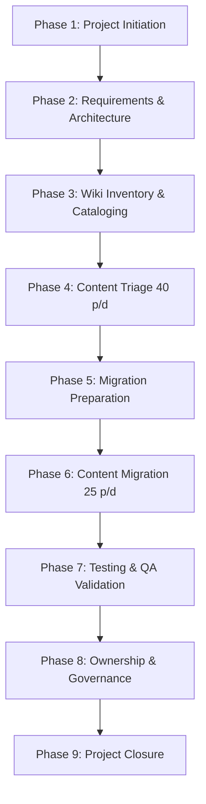
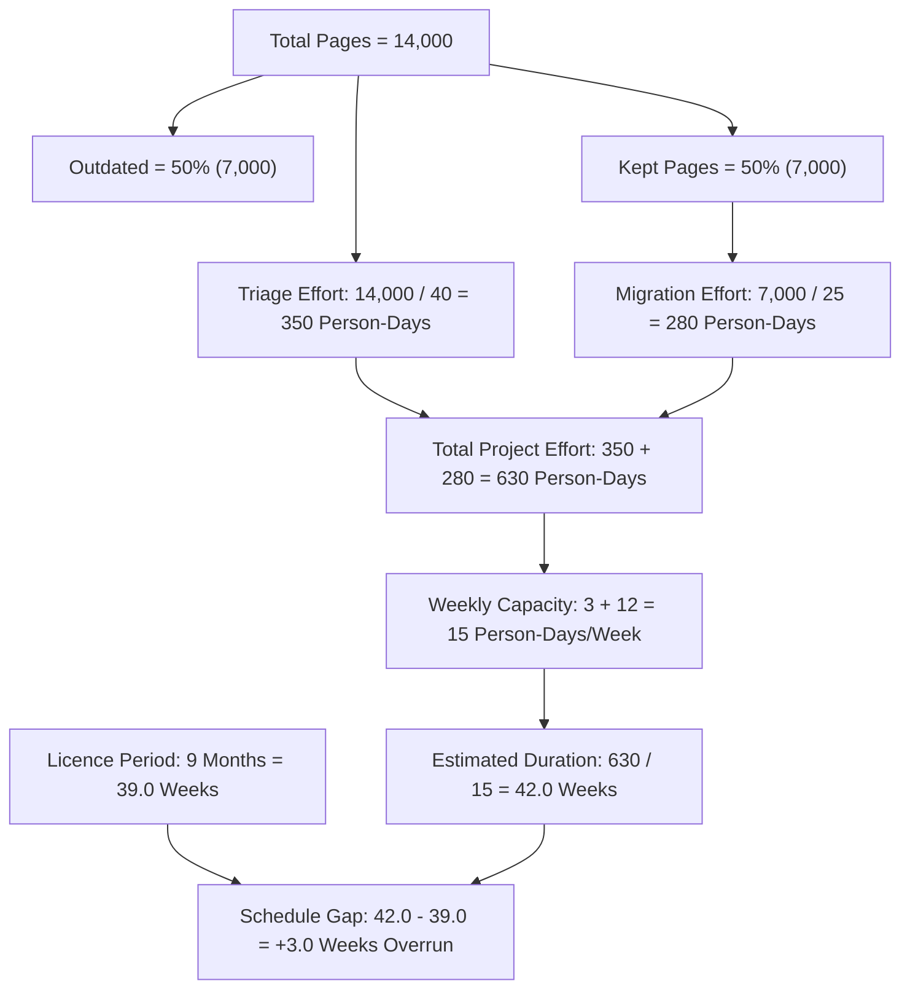

# Project Management Plan & Estimation Specification
## Project WikiMove – Migrating a Company Knowledge Base to a New Platform

**Document Identifier:** WM-PMP-1.0  
**Project Name:** WikiMove  
**Course:** Software Engineering & Project Management  
**Academic Term:** Final Academic Submission  
**Student Name:** [Student Name / ID Placeholder]  
**Institution:** [Department of Computer Science & Engineering / University Placeholder]  
**Date:** Academic Term 2026  
**Status:** Approved for Academic Submission  

---

### Table of Contents
1. Executive Summary & Project Context
2. Project Objectives & Boundary Management
3. Project Phases & Lifecycle Model
4. Work Breakdown Structure (WBS)
5. Activity Precedence & Dependencies
6. Milestones & Target Schedule
7. Resource Allocation & Weekly Capacity Modeling
8. Mathematical Estimation Sheet (Detailed Formulas)
9. Gantt Chart Representation (42 Weeks vs. 39 Weeks)
10. Critical Path Method (CPM) Analysis
11. Licence Expiry Gap Analysis & Mitigation Strategies

---

### 1. Executive Summary & Project Context

Project WikiMove is an enterprise-scale software engineering documentation and migration initiative designed to decommission an aging, ungoverned internal wiki comprising **14,000 pages** accumulated over 11 years. The organizational imperative is driven by an immovable external constraint: **the legacy platform software licence expires in 9 months (~39 weeks)**.

The initiative is led by a dedicated Technical Writer operating on a part-time project allocation of **3 person-days per week**, supported by **12 engineering teams** contributing **1 person-day per week each**. The core challenge is addressing the mathematical schedule conflict between total required effort (630 person-days = 42.0 weeks) and the 39-week licence window, while instituting sustainable content ownership to prevent future wiki decay.

---

### 2. Project Objectives & Boundary Management

#### 2.1 Project Objectives
- **OBJ-01:** Complete 100% triage of all 14,000 legacy pages into Keep, Archive, or Delete.
- **OBJ-02:** Execute high-fidelity migration of exactly 7,000 retained pages (50% assumption) to the new platform.
- **OBJ-03:** Assign 100% of migrated content to validated named human custodians (Zero Orphan Policy).
- **OBJ-04:** Achieve 0.0% broken internal links (NFR-01) and sub-second search discoverability (NFR-02).
- **OBJ-05:** Formulate and manage contingency options for the 3-week schedule gap.

#### 2.2 Boundary Management (Academic Scope)
In accordance with academic instructions, WikiMove is an academic software engineering and project management proposed system. Project deliverables focus on complete technical specifications, rigorous mathematical estimation, WBS, Gantt scheduling, risk frameworks, and static UI mockups. No backend services, cloud infrastructures, databases, or production APIs are deployed.

---

### 3. Project Phases & Lifecycle Model

WikiMove adopts a phased linear-iterative lifecycle structured into 9 coherent academic phases:



- **Phase 1 — Initiation (Weeks 1–2):** Project charter approval, stakeholder alignment, governance setup.
- **Phase 2 — Requirements & Architecture (Weeks 3–4):** IEEE 830 SRS, BRD baseline, UML modeling, UI prototyping.
- **Phase 3 — Wiki Inventory (Weeks 5–6):** Automated metadata export of 14,000 pages, team domain mapping.
- **Phase 4 — Content Triage (Weeks 7–22):** 14,000 pages triaged at 40 pages/day across 12 teams + TW.
- **Phase 5 — Migration Preparation (Weeks 20–22):** URL rewrite registry, formatting templates, target schema setup.
- **Phase 6 — Content Migration (Weeks 23–36):** 7,000 kept pages migrated in sprint batches at 25 pages/day.
- **Phase 7 — Testing & QA Validation (Weeks 34–38):** Link integrity scanning, search indexing QA, defect resolution.
- **Phase 8 — Ownership & Governance (Weeks 37–40):** Named owner binding, 90-day review rules, handover.
- **Phase 9 — Project Closure (Weeks 41–42):** Final audit, closure note, lessons learned, legacy shutdown.

---

### 4. Work Breakdown Structure (WBS)

```text
1.0 Project WikiMove
├── 1.1 Project Initiation & Governance
│   ├── 1.1.1 Project Charter & Stakeholder Matrix
│   └── 1.1.2 Team Allocation & Cadence Setup (15 p-d/wk)
├── 1.2 Requirements & Architecture
│   ├── 1.2.1 Business Requirements Document (BRD)
│   ├── 1.2.2 IEEE 830 Software Requirements Specification (SRS)
│   ├── 1.2.3 UML Design Package (7 Diagrams)
│   └── 1.2.4 Static UI Prototype Design (6 Screens)
├── 1.3 Wiki Inventory & Ingestion
│   ├── 1.3.1 14,000 Page Legacy Extraction
│   └── 1.3.2 Domain Tagging & 12 Team Partitioning
├── 1.4 Content Triage (14,000 Pages @ 40 p/d = 350 p-d)
│   ├── 1.4.1 Engineering Domain Review (Keep / Archive / Delete)
│   ├── 1.4.2 Orphan Page Reclamation by Technical Writer
│   └── 1.4.3 Archival Cold Storage Packaging (3,500 Pages)
├── 1.5 Migration Planning & Tooling Setup
│   ├── 1.5.1 URL Rewrite Engine & 301 Redirection Schema
│   └── 1.5.2 Migration Batch Construction (7,000 Kept Pages)
├── 1.6 Content Migration (7,000 Kept Pages @ 25 p/d = 280 p-d)
│   ├── 1.6.1 Batch Execution (Sprint Batches 1..10)
│   └── 1.6.2 Asset & Code Snippet Formatting Transposition
├── 1.7 Testing, Verification & Quality Assurance
│   ├── 1.7.1 Automated Link Integrity Crawler (NFR-01)
│   ├── 1.7.2 Search Index & Ranking Validation (NFR-02)
│   └── 1.7.3 DRE & Defect Density Metric Logging
├── 1.8 Ownership & Post-Migration Governance
│   ├── 1.8.1 Named Owner Binding (Zero Orphan Policy)
│   └── 1.8.2 90-Day Periodic Review Workflow Configuration
└── 1.9 Project Closure & Handover
    ├── 1.9.1 Final Project Report & Academic Presentation
    ├── 1.9.2 Decommission Audit & Licence Handover
    └── 1.9.3 Lessons Learned & Post-Mortem Documentation
```

---

### 5. Activity Precedence, Duration & Dependencies

| Task ID | Activity Description | Predecessor | Duration (Weeks) | Required Effort (p-d) | Primary Resource |
| :--- | :--- | :--- | :--- | :--- | :--- |
| **A1** | Project Initiation & Chartering | None | 2 | 10 | PM, CTO, TW |
| **A2** | Requirements Engineering (BRD &amp; SRS) | A1 | 2 | 20 | BA, TW |
| **A3** | Architecture, UML &amp; UI Mockups | A2 | 2 | 15 | System Architect, UI Designer |
| **A4** | Legacy 14k Page Inventory Ingestion | A1 | 2 | 10 | TW, Data Analyst |
| **A5** | Content Triage (14,000 pages @ 40 p/d) | A3, A4 | 16 | **350** | **12 Teams + TW (15 p-d/wk)** |
| **A6** | Migration Prep &amp; URL Rewrite Rules | A4 | 3 | 15 | TW, QA Engineer |
| **A7** | Migration Execution (7k pages @ 25 p/d) | A5, A6 | 14 | **280** | **12 Teams + TW (15 p-d/wk)** |
| **A8** | Link &amp; Search QA Testing | A7 | 4 | 20 | QA Engineer, TW |
| **A9** | Ownership Binding &amp; Governance Rules | A5, A7 | 3 | 15 | TW, Eng Leads |
| **A10** | Final Decommission &amp; Project Closure | A8, A9 | 2 | 10 | PM, CTO, TW |

---

### 6. Milestone Schedule

| Milestone ID | Milestone Deliverable / Event | Scheduled Week | Critical Status |
| :--- | :--- | :--- | :--- |
| **M1** | Project Charter &amp; Baseline Requirements Approved | Week 4 | Baseline Milestone |
| **M2** | 14,000 Legacy Inventory Extracted &amp; Partitioned | Week 6 | Input to Triage |
| **M3** | Mid-Point Triage Review (7,000 Pages Triaged) | Week 14 | Schedule Tracking Gate |
| **M4** | 100% Triage Complete (14,000 Pages Processed) | Week 22 | Triage Exit Gate |
| **M5** | First 2,500 Kept Pages Migrated &amp; Verified | Week 28 | Migration Velocity Check |
| **M6** | 100% Kept Pages Migrated (7,000 Pages on Target) | Week 36 | Core Technical Goal |
| **M7** | **Legacy Platform Software Licence Expiration** | **Week 39** | **HARD DEADLINE (39 Wks)** |
| **M8** | Final QA Sign-off &amp; Governance Certification | Week 40 | Quality Acceptance |
| **M9** | **Full Project Closure (Baseline Completion)** | **Week 42** | **3-Week Overrun Beyond M7** |

---

### 7. Resource Allocation & Weekly Capacity Modeling

The project operates under a strict, non-negotiable weekly resource ceiling:

$$\text{Technical Writer Allocation} = 3\text{ person-days / week}$$
$$\text{12 Engineering Teams Allocation} = 12 \times 1\text{ person-day / week} = 12\text{ person-days / week}$$
$$\text{Total Weekly Capacity } (C) = 3 + 12 = \mathbf{15\text{ person-days / week}}$$

This fixed capacity ceiling dictates that any task must be scheduled within 15 person-days per calendar week unless formal management contingencies are triggered.

---

### 8. Mathematical Estimation Sheet (Detailed Formulas)

The estimation model is derived strictly from the case-study empirical data:



#### Step 1: Inventory & Retention Volume
$$\text{Total Wiki Inventory } (N) = 14,000\text{ pages}$$
$$\text{Outdated Ratio } (r_{outdated}) = 50\% \implies 14,000 \times 0.50 = 7,000\text{ pages}$$
$$\text{Kept Pages } (N_{kept}) = 14,000 \times 50\% = \mathbf{7,000\text{ pages}}$$

#### Step 2: Triage Effort Calculation
$$\text{Triage Velocity } (v_{triage}) = 40\text{ pages / person-day}$$
$$\text{Triage Effort } (E_{triage}) = \frac{N}{v_{triage}} = \frac{14,000}{40} = \mathbf{350\text{ person-days}}$$

#### Step 3: Migration Effort Calculation
$$\text{Migration Velocity } (v_{migration}) = 25\text{ pages / person-day}$$
$$\text{Migration Effort } (E_{migration}) = \frac{N_{kept}}{v_{migration}} = \frac{7,000}{25} = \mathbf{280\text{ person-days}}$$

#### Step 4: Total Project Effort
$$E_{total} = E_{triage} + E_{migration} = 350 + 280 = \mathbf{630\text{ person-days}}$$

#### Step 5: Estimated Project Duration
$$D = \frac{E_{total}}{C} = \frac{630\text{ person-days}}{15\text{ person-days / week}} = \mathbf{42.0\text{ weeks}}$$

#### Step 6: Licence Expiry Timeline & Gap Calculation
$$\text{Licence Period } (T_{licence}) = 9\text{ months}$$
$$\text{Standard Academic Conversion Rate} = 4.333\text{ weeks / month}$$
$$T_{licence} = 9 \times 4.333 \approx \mathbf{39.0\text{ weeks}}$$
$$\text{Schedule Gap } (\Delta T) = D - T_{licence} = 42.0 - 39.0 = \mathbf{+3.0\text{ weeks (Schedule Overrun)}}$$

---

### 9. Gantt Chart Representation (42 Weeks vs. 39 Weeks)

The Gantt schedule below illustrates the 9 phases across 42 weeks, highlighting the 39-week licence expiration boundary and the 3-week conflict.

```text
Activity / Phase              Wk 1-4   Wk 5-8   Wk 9-12  Wk 13-16 Wk 17-20 Wk 21-24 Wk 25-28 Wk 29-32 Wk 33-36 Wk 37-39 [Wk 39: LICENCE] Wk 40-42
---------------------------------------------------------------------------------------------------------------------------------------------
Phase 1: Initiation           [====]
Phase 2: Requirements & Arch       [====]
Phase 3: Wiki Inventory            [====]
Phase 4: Content Triage (350 p-d)       [=======================================]
Phase 5: Migration Prep                                       [======]
Phase 6: Migration (280 p-d)                                                [===================================]
Phase 7: Testing & Validation                                                                        [=============]
Phase 8: Ownership & Governance                                                                            [===========]
Phase 9: Closure & Handover                                                                                               [====== OVERRUN =====]
---------------------------------------------------------------------------------------------------------------------------------------------
MILESTONE: Licence Expiry                                                                                             |*** WEEK 39 DEADLINE ***|
SCHEDULE OVERRUN DEFICIT                                                                                              |====== +3.0 WEEKS ======|
```

---

### 10. Critical Path Method (CPM) Analysis

The critical path determines the minimum project duration. Any delay in critical activities directly extends the 42-week project duration:

$$\text{Critical Path: } \text{A2 (Requirements)} \longrightarrow \text{A4 (Inventory)} \longrightarrow \text{A5 (Triage)} \longrightarrow \text{A7 (Migration)} \longrightarrow \text{A8 (Testing)} \longrightarrow \text{A10 (Closure)}$$

- **Critical Activities (Zero Slack):**
  - Activity A5 (Content Triage, 350 person-days): 16 weeks duration on critical path.
  - Activity A7 (Content Migration, 280 person-days): 14 weeks duration on critical path.
- **Total Critical Path Duration:** Exactly **42.0 weeks**, exceeding the 39.0-week licence limit.

---

### 11. Licence Expiry Conflict & Management Recommendations

Because the baseline estimate exceeds the licence expiration by 3.0 weeks, the project manager must implement academic contingency strategies:

1. **Strategy 1 — Commercial Licence Extension (Recommended Primary):** Negotiate a 1-month (4.3-week) bridging licence with the legacy wiki vendor to provide buffer through Week 43.
2. **Strategy 2 — Resource Uplift (Capacity Compression):** Increase the Technical Writer's allocation from 3 to 5 person-days/week during Weeks 15–35 (adding +40 person-days) or allocate 1 additional engineer per team during final migration, compressing duration from 42 weeks to 37.5 weeks.
3. **Strategy 3 — Phased Core Migration (Scope Staging):** Prioritize the top 5,000 high-traffic core pages for migration before Week 39; complete the remaining 2,000 low-priority pages during read-only archive mode.
