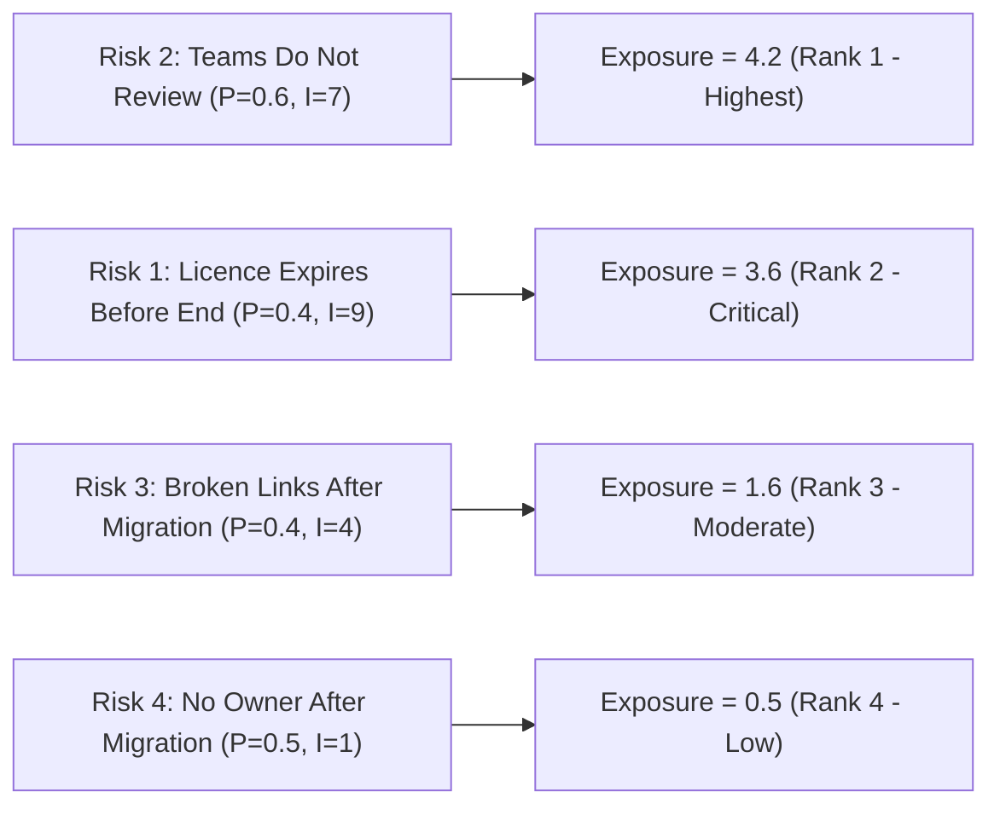

# Risk Management Plan & RMMM Specification
## Project WikiMove – Migrating a Company Knowledge Base to a New Platform

**Document Identifier:** WM-RSK-1.0  
**Project Name:** WikiMove  
**Course:** Software Engineering & Project Management  
**Academic Term:** Final Academic Submission  
**Student Name:** Sanchita Suryawanshi  
**Roll Number:** 150096724115  
**Institution:** [Department of Computer Science & Engineering / University Placeholder]  
**Date:** Academic Term 2026  
**Status:** Approved for Academic Submission  

---

### Table of Contents
1. Executive Summary & Risk Framework
2. Quantitative Risk Identification & Exposure Calculation
3. Risk Exposure Ranking & Prioritization
4. 5×5 Probability-Impact Matrix
5. Comprehensive Project Risk Register
6. Risk Mitigation, Monitoring, and Management (RMMM) Plan (Top 3 Risks)
7. Post-Migration Governance Plan (Decay Prevention)

---

### 1. Executive Summary & Risk Framework

Risk management in **Project WikiMove** is governed by quantitative risk exposure modeling and proactive mitigation. Operating under an aggressive timeline where the legacy wiki platform licence expires in **9 months (~39 weeks)**, the project is exposed to organizational, schedule, technical, and governance risks.

The project employs the standard software engineering Risk Exposure metric:

$$\text{Risk Exposure } (E) = \text{Probability } (P) \times \text{Impact } (I)$$

Where:
- **Probability ($P$):** Likelihood of risk occurrence on a normalized scale from $0.0$ to $1.0$.
- **Impact ($I$):** Severity of consequence to project objectives on an ordinal scale from $1$ (Negligible) to $10$ (Catastrophic).
- **Exposure ($E$):** Composite risk magnitude used to establish strict management ranking.

---

### 2. Quantitative Risk Identification & Exposure Calculation

All four primary risks are derived directly from the empirical case study data:



#### Risk 1: Licence expires before project completion
- **Probability ($P_1$):** $0.4$ (40% likelihood)
- **Impact ($I_1$):** $9$ (Catastrophic loss of access to legacy data)
- **Exposure ($E_1$):** $0.4 \times 9 = \mathbf{3.6}$

#### Risk 2: Teams do not review pages
- **Probability ($P_2$):** $0.6$ (60% likelihood due to sprint pressures)
- **Impact ($I_2$):** $7$ (Major breakdown in triage throughput)
- **Exposure ($E_2$):** $0.6 \times 7 = \mathbf{4.2}$

#### Risk 3: Broken links after migration
- **Probability ($P_3$):** $0.4$ (40% likelihood across 14,000 legacy references)
- **Impact ($I_3$):** $4$ (Moderate disruption to engineering workflows)
- **Exposure ($E_3$):** $0.4 \times 4 = \mathbf{1.6}$

#### Risk 4: No owner after migration
- **Probability ($P_4$):** $0.5$ (50% likelihood without automated enforcement)
- **Impact ($I_4$):** $1$ (Minor localized delay in long-term updates)
- **Exposure ($E_4$):** $0.5 \times 1 = \mathbf{0.5}$

---

### 3. Risk Exposure Ranking & Prioritization

| Priority Rank | Risk ID | Risk Description | Probability (P) | Impact (I) | Exposure ($E = P \times I$) | Severity Category | Management Focus |
| :---: | :--- | :--- | :---: | :---: | :---: | :--- | :--- |
| **1** | **R2** | **Teams do not review pages** | **0.6** | **7** | **4.2** | **Critical (Highest)** | Active RMMM; Executive Sponsor Intervention |
| **2** | **R1** | **Licence expires before project completion** | **0.4** | **9** | **3.6** | **High (Critical)** | Active RMMM; Schedule Gap & Buffer Containment |
| **3** | **R3** | **Broken links after migration** | **0.4** | **4** | **1.6** | **Moderate** | Active RMMM; Automated URL Rewriting & QA |
| **4** | **R4** | **No owner after migration** | **0.5** | **1** | **0.5** | **Low** | Standard Operating Procedure; System Gate |

---

### 4. 5×5 Probability-Impact Matrix

```text
Impact (1-10) ->
[10] Catastrophic |                          |  R1 (P=0.4, I=9) [E=3.6] |                          |
[ 8] Severe       |                          |                          |  R2 (P=0.6, I=7) [E=4.2] |
[ 6] Major        |                          |                          |                          |
[ 4] Moderate     |                          |  R3 (P=0.4, I=4) [E=1.6] |                          |
[ 2] Minor        |  R4 (P=0.5, I=1) [E=0.5] |                          |                          |
------------------+--------------------------+--------------------------+--------------------------+
Probability (0-1) | Low (0.0 - 0.2)          | Moderate (0.2 - 0.4)     | High (0.4 - 0.7)         | Very High (> 0.7)
```

- **Red Zone (Critical Attention):** R2 ($E=4.2$) and R1 ($E=3.6$) require formalized RMMM plans, executive oversight, and weekly burn-down tracking.
- **Yellow Zone (Proactive Mitigation):** R3 ($E=1.6$) requires automated validation scripts and crawler tooling.
- **Green Zone (Routine Governance):** R4 ($E=0.5$) is managed programmatically via system-level owner assignment gates.

---

### 5. Comprehensive Project Risk Register

| Risk ID | Description | P | I | Exposure | Rank | Risk Owner | Mitigation Strategy | Monitoring Mechanism | Trigger Event | Contingency Plan |
| :--- | :--- | :---: | :---: | :---: | :---: | :--- | :--- | :--- | :--- | :--- |
| **R2** | Teams do not review pages | 0.6 | 7 | 4.2 | 1 | CTO &amp; Engineering Leads | Mandatory sprint capacity allocation (1 p-d/wk); pre-triage by Technical Writer. | Weekly triage burndown vs 40 p/d quota. | Team completes < 70% of weekly triage quota for 2 consecutive weeks. | CTO escalates; TW takes over preliminary triage; non-compliant team sprint capacity frozen. |
| **R1** | Licence expires before project completion | 0.4 | 9 | 3.6 | 2 | Project Manager | Prioritize 7k kept pages; parallelize migration; negotiate bridging buffer. | Milestone gap tracking against Week 39 deadline. | Schedule slip exceeds 10 working days on Critical Path. | Trigger 30-day bridging licence with legacy vendor; compress scope to top 5,000 core pages. |
| **R3** | Broken links after migration | 0.4 | 4 | 1.6 | 3 | Technical Writer &amp; QA | Global URL rewrite mapping; regex link checker; automated redirect tables. | Automated crawler link scan reports. | Crawler discovers > 1.0% broken intra-wiki links in a batch. | Roll back batch; apply automated bulk regex rewrite script; manual link remapping. |
| **R4** | No owner after migration | 0.5 | 1 | 0.5 | 4 | Governance Custodian | System gate: prohibit migration without named custodian; 90-day review reminder. | Orphan page count on Dashboard (Screen 5). | Unassigned kept page queued for migration. | Reassign page to domain Engineering Manager by default; notify squad lead. |

---

### 6. RMMM Plan for Top 3 Risks

#### 6.1 RMMM for Risk 2: Teams do not review pages ($E = 4.2$, Rank 1)
- **Core Problem:** Engineering teams prioritize roadmap feature delivery over documentation review.
- **Mitigation (Pre-event Actions):**
  1. Secure formal CTO executive directive establishing 1 person-day per week per team as a non-negotiable KPI.
  2. Technical Writer pre-filters trivial, empty, and duplicate pages to reduce engineering cognitive load.
  3. Provide intuitive, 1-click triage UI (Screen 2 & Screen 3) requiring < 12 minutes per page review.
- **Monitoring:** Weekly automated triage velocity dashboards presented at Tuesday engineering standups.
- **Trigger:** Any team falling more than 20% below their cumulative triage quota by Week 12.
- **Contingency (Post-trigger Actions):**
  1. Dedicate a focused "Triage Hackathon" day where squads review remaining pages in sprint blocks.
  2. Technical Writer assumes default decision authority for unreviewed pages (> 60 days inactive = Archive).
- **Owner:** Chief Technology Officer & Engineering Team Leads.

#### 6.2 RMMM for Risk 1: Licence expires before project completion ($E = 3.6$, Rank 2)
- **Core Problem:** Total required effort (630 person-days = 42 weeks) exceeds the 39-week licence duration by 3 weeks.
- **Mitigation (Pre-event Actions):**
  1. Implement immediate critical path monitoring on activities A5 (Triage) and A7 (Migration).
  2. Parallelize migration batches (Phase 6) alongside the final weeks of triage (Phase 4).
  3. Pre-negotiate a commercial 30-day licence extension option with the legacy software vendor.
- **Monitoring:** Bi-weekly Critical Path Method (CPM) slack analysis tracking projected cutover vs Week 39.
- **Trigger:** Cumulative project progress lags by more than 2 weeks by Milestone M4 (Week 22).
- **Contingency (Post-trigger Actions):**
  1. **Option A (Licence Extension):** Formally activate the 30-day bridging licence through Week 43.
  2. **Option B (Resource Uplift):** Increase Technical Writer capacity from 3 to 5 p-d/week for Weeks 20–36.
  3. **Option C (Core Staging):** Migrate the top 5,000 mission-critical pages by Week 39; perform read-only archival of the remaining 2,000 pages.
- **Owner:** Project Manager & CTO.

#### 6.3 RMMM for Risk 3: Broken links after migration ($E = 1.6$, Rank 3)
- **Core Problem:** 14,000 legacy pages contain inter-page references with hardcoded legacy URL paths that break upon transfer.
- **Mitigation (Pre-event Actions):**
  1. Build an automated URL remapping lookup table translating legacy page IDs to target platform slugs.
  2. Establish 301 server redirects on the legacy domain pointing to new platform URLs.
  3. Execute automated regex hyperlink linters on all batches prior to production release.
- **Monitoring:** Automated link crawler verification executing against 100% of migrated content.
- **Trigger:** Discovery of any broken internal hyperlink during batch certification.
- **Contingency (Post-trigger Actions):**
  1. Block batch sign-off; execute automated batch search-and-replace script across broken anchors.
  2. For links targeting deleted legacy pages, replace anchor with an archived notification stub.
- **Owner:** Technical Writer & QA Engineer.

---

### 7. Post-Migration Governance Plan (Wiki Decay Prevention)

To honor the CTO’s core objective—ensuring that the new knowledge platform does not decay again over time—WikiMove implements a strict post-migration governance framework:

1. **Mandatory Single Human Custodian:** Every active wiki page must have one designated, active named owner. Shared group aliases (e.g., `team@company.com`) are prohibited.
2. **Automated 90-Day Periodic Review:** Every 90 calendar days from the last certification, the system issues an automated review prompt to the named owner.
3. **Escalation & Orphan Resolution:** If an owner leaves the company or fails to recertify within 14 days of notice, the page escalates to the domain Engineering Lead.
4. **Semi-Annual Archive Sweep:** Pages inactive for > 180 days without update or owner confirmation are automatically flagged for archival.
5. **Quarterly Broken Link Audits:** Automated crawlers scan the entire target platform quarterly, reporting any dead external or internal hyperlinks.
