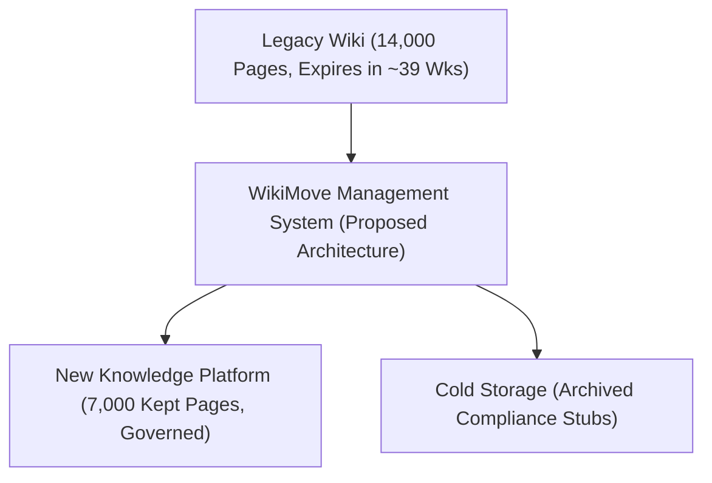

# Software Requirements Specification (SRS)
## Project WikiMove – Migrating a Company Knowledge Base to a New Platform
### IEEE Std 830-1998 Compliant Specification

**Document Identifier:** WM-SRS-1.0  
**Project Name:** WikiMove  
**Course:** Software Engineering & Project Management  
**Academic Term:** Final Academic Submission  
**Student Name:** [Student Name / ID Placeholder]  
**Institution:** [Department of Computer Science & Engineering / University Placeholder]  
**Date:** Academic Term 2026  
**Status:** Baseline Specification Approved for Academic Evaluation  

---

### Table of Contents
1. Introduction (Purpose, Scope, Definitions, References)
2. Overall Description (Product Perspective, User Classes, Constraints, Assumptions)
3. External Interface Requirements (UI, Hardware, Software, Communication)
4. Functional Requirements (FR-01 through FR-15)
5. Non-Functional Requirements (NFR-01 through NFR-10)
6. Requirements Traceability Matrix (RTM)

---

### 1. Introduction

#### 1.1 Purpose
This Software Requirements Specification (SRS) defines the functional, non-functional, and interface requirements for the **WikiMove System** in accordance with IEEE Std 830-1998 guidelines. The system serves as a project management, inventory tracking, triage classification, and governance platform to migrate an enterprise knowledge base of **14,000 legacy pages** to a new modern knowledge platform before legacy licence expiration in **9 months (~39 weeks)**.

#### 1.2 Scope
WikiMove encompasses the specification of workflows for:
- Ingesting and partitioning 14,000 legacy wiki pages across 12 engineering teams.
- Conducting tri-state triage (Keep, Archive, Delete) at a benchmark rate of 40 pages per person-day.
- Planning and tracking the migration of 7,000 retained pages (50% kept assumption) at 25 pages per person-day.
- Enforcing mandatory human content ownership (Zero Orphan Policy).
- Validating post-migration link integrity and search discoverability.
- Tracking mathematical schedule burn-down (630 total person-days, 15 person-days/week capacity, 42-week duration vs. 39-week licence limit).
- Managing long-term 90-day periodic content governance.

*Academic Notice:* Consistent with university instructions, WikiMove is an academic software engineering proposed system. Functional implementation is represented through static UI mockups; no live production database, backend, or cloud services are deployed.

#### 1.3 Definitions, Acronyms, and Abbreviations
- **BRD:** Business Requirements Document
- **BVA:** Boundary Value Analysis
- **CTO:** Chief Technology Officer
- **DRE:** Defect Removal Efficiency
- **FR:** Functional Requirement
- **IEEE:** Institute of Electrical and Electronics Engineers
- **MoSCoW:** Must have, Should have, Could have, Won't have
- **NFR:** Non-Functional Requirement
- **Person-Day (p-d):** Unit of effort equal to one standard working day (8 hours) of one engineer.
- **RMMM:** Risk Mitigation, Monitoring, and Management Plan
- **RTM:** Requirements Traceability Matrix
- **SRS:** Software Requirements Specification
- **Triage:** Systematic process of inspecting content and categorizing into Keep, Archive, or Delete.
- **TW:** Technical Writer (Project Lead)

---

### 2. Overall Description

#### 2.1 Product Perspective
WikiMove operates as an administrative management and governance layer positioned between the aging Legacy Wiki Platform and the Target Knowledge Platform.

#### 2.2 User Classes & Characteristics
1. **Technical Writer (Project Lead):** Power user; coordinates overall migration, oversees orphan reassignments, audits QA logs, monitors schedule gap. (Allocation: 3 person-days/week).
2. **Engineering Team Members (12 Teams):** Domain reviewers; triage subsystem pages, update content, assign named owners. (Allocation: 1 person-day/week per team = 12 person-days/week).
3. **Content Owners:** Named custodians; accept accountability for specific kept pages and execute 90-day periodic revalidations.
4. **Project Manager:** Monitors WBS, milestones, critical path, risk exposures, and resource constraints.
5. **QA / Test Engineer:** Validates link integrity, verifies search indexing, logs defect density.
6. **CTO / Management:** Executive stakeholder; reviews dashboard KPIs and enforces organizational compliance.

#### 2.3 General Constraints & Assumptions
- **Constraint C-01:** The project must achieve decommission readiness within 9 months (approximately 39 weeks).
- **Constraint C-02:** Weekly effort cannot exceed 15 person-days per week (3 TW + 12 Engineering).
- **Constraint C-03 (Academic):** System must not require live production backend, database, or API deployment.
- **Assumption A-01:** Exactly 50% of the 14,000 pages (7,000 pages) will be designated as Keep.
- **Assumption A-02:** Triage review velocity is fixed at 40 pages per person-day.
- **Assumption A-03:** Migration velocity is fixed at 25 pages per person-day.

---

### 3. External Interface Requirements

#### 3.1 User Interfaces
The system provides 6 responsive, accessible, card-based static screens adhering to light-theme aesthetics:
- **Screen 1 (Dashboard):** High-level metrics, progress bars, licence timer, top risk card.
- **Screen 2 (Page Triage):** Filterable table of assigned pages with Keep, Archive, and Delete controls.
- **Screen 3 (Page Review):** Split-view content inspector, metadata display, reviewer notes, and owner binding.
- **Screen 4 (Migration Status):** Batch tracking for the 7,000 kept pages, validation status, error log.
- **Screen 5 (Ownership Management):** Content custody registry displaying assigned owners and 90-day review dates.
- **Screen 6 (Risks & Schedule):** Quantitative risk matrix (R1-R4) and 42-week vs. 39-week schedule breakdown.

#### 3.2 Hardware & Communication Interfaces
- Standard client web browsers (Chrome, Safari, Firefox, Edge) supporting HTML5, CSS3, and modern ECMAScript.
- Standard HTTP/HTTPS network communication (zero specialized hardware required).

---

### 4. Functional Requirements

#### FR-01: Page Inventory Management
- **Description:** The system shall ingest and index metadata for all 14,000 legacy wiki pages.
- **Inputs:** Legacy platform page export (Page ID, Title, URL, Creation Date, Last Modified, Subsystem Tag).
- **Processing:** Parse metadata, assign unique WikiMove ID (`WP-xxxxx`), flag age (> 3 years = potentially outdated).
- **Outputs:** Searchable centralized inventory viewable on Dashboard and Triage screens.

#### FR-02: Page Review Interface
- **Description:** The system shall display legacy page content, active hyperlinks, revision history, and author metadata for inspection.
- **Inputs:** Page ID selection from Triage queue.
- **Processing:** Render HTML/Markdown content preview, extract internal and external link targets.
- **Outputs:** Rendered document display on Screen 3.

#### FR-03: Page Classification Engine
- **Description:** The system shall enable reviewers to assign exactly one terminal triage classification to each page: Keep, Archive, or Delete.
- **Inputs:** Reviewer action button click (`Keep`, `Archive`, `Delete`) and mandatory justification comment.
- **Processing:** Validate reviewer authorization; verify that daily triage throughput tracks against the 40 pages/day benchmark.
- **Outputs:** State transition recorded; page status updated in inventory.

#### FR-04: Keep Page Workflow
- **Description:** The system shall transition valid, accurate pages to `Kept` status, qualifying them for migration.
- **Inputs:** Reviewer selects `Keep` classification.
- **Processing:** Verify content is current; enforce mandatory input of a valid `Content Owner`. Total kept volume capped at 50% baseline (7,000 pages).
- **Outputs:** Page queued in `KeptPendingMigration` state.

#### FR-05: Archive Page Workflow
- **Description:** The system shall transition historical or compliance-mandatory pages to `Archived` status.
- **Inputs:** Reviewer selects `Archive` with retention rationale (e.g., Legal, Audit, Deprecated Architecture).
- **Processing:** Generate read-only archival snapshot; create a redirection stub for legacy URLs.
- **Outputs:** Page marked `Archived`; removed from migration queue.

#### FR-06: Delete Page Workflow
- **Description:** The system shall flag obsolete, redundant, or empty pages for permanent decommissioning.
- **Inputs:** Reviewer selects `Delete`.
- **Processing:** Apply a 14-day soft-delete grace window; generate dead-link redirection notices.
- **Outputs:** Page marked `MarkedForDeletion`; permanently purged following grace expiration.

#### FR-07: Content Owner Designation (Zero Orphan Policy)
- **Description:** The system shall prohibit any page from migrating unless an active, named employee is assigned as Content Owner.
- **Inputs:** Content Owner employee ID, email, and engineering squad.
- **Processing:** Validate employee active status against organizational directory. Flag unassigned pages as `Orphan Alert`.
- **Outputs:** Owner bound to page metadata; automated welcome notification sent to owner.

#### FR-08: Migration Batch Planning
- **Description:** The system shall group the 7,000 kept pages into sprint migration batches sized according to team capacity.
- **Inputs:** Domain category, target batch size, scheduled sprint window.
- **Processing:** Calculate required effort using benchmark migration velocity of 25 pages per person-day ($7,000 / 25 = 280\text{ person-days}$).
- **Outputs:** Scheduled migration batches displayed on Screen 4.

#### FR-09: Migration Progress Tracking
- **Description:** The system shall track the live execution status of every migration batch across states: Queued, In Progress, Migrated, Validation Pending, and Certified.
- **Inputs:** Batch execution updates.
- **Processing:** Compute real-time completion %, velocity variance, and remaining person-days.
- **Outputs:** Dynamic progress bars and burn-down metrics.

#### FR-10: Link Integrity Validation
- **Description:** The system shall validate all hyperlinks within migrated pages to prevent broken links post-cutover.
- **Inputs:** Migrated page content.
- **Processing:** Scan anchor tags; match legacy intra-wiki URLs against the WikiMove rewrite registry. Verify HTTP 200 response on external targets.
- **Outputs:** Link validation status (Certified vs. Broken Link Defect Logged).

#### FR-11: Search Discoverability Validation
- **Description:** The system shall verify that every migrated page is successfully indexed and discoverable in the target platform's search engine.
- **Inputs:** Page title, keywords, and domain tags.
- **Processing:** Execute synthetic test queries against target search index; verify page surfaces within top 5 search results.
- **Outputs:** Search index certification status.

#### FR-12: Project Progress & Schedule Tracking
- **Description:** The system shall monitor cumulative project effort and compare completion forecasting against the 39-week licence expiration deadline.
- **Inputs:** Cumulative triage person-days and migration person-days expended.
- **Processing:** Compute: Total Effort = $350 + 280 = 630\text{ p-d}$. Duration = $630 / 15 = 42\text{ weeks}$. Schedule Gap = $42 - 39 = +3.0\text{ weeks}$.
- **Outputs:** Visual schedule gap alerts on Dashboard (Screen 1) and Risks screen (Screen 6).

#### FR-13: Risk Tracking & RMMM Integration
- **Description:** The system shall maintain an active risk log for all identified project risks, calculating Exposure ($E = P \times I$) and maintaining mitigation triggers.
- **Inputs:** Risk IDs (R1, R2, R3, R4), Probability, Impact.
- **Processing:** Calculate:
  - $R2\text{ (Teams no review)} = 0.6 \times 7 = 4.2\text{ (Rank 1)}$
  - $R1\text{ (Licence expires)} = 0.4 \times 9 = 3.6\text{ (Rank 2)}$
  - $R3\text{ (Broken links)} = 0.4 \times 4 = 1.6\text{ (Rank 3)}$
  - $R4\text{ (No owner)} = 0.5 \times 1 = 0.5\text{ (Rank 4)}$
- **Outputs:** Risk exposure rankings, mitigation owner assignments, and contingency status.

#### FR-14: Management Reporting & KPI Analytics
- **Description:** The system shall generate consolidated progress summaries for the CTO, Project Manager, and Technical Writer.
- **Inputs:** Aggregated triage, migration, QA, and ownership logs.
- **Processing:** Compile completion percentages, defect removal efficiency (DRE), defect density, and team quota adherence.
- **Outputs:** Printable executive summaries and real-time dashboard visualizations.

#### FR-15: Post-Migration Ownership & Governance
- **Description:** The system shall enforce a sustainable post-migration content lifecycle by executing automated 90-day revalidation notifications.
- **Inputs:** Last reviewed timestamp.
- **Processing:** Check if current date exceeds last review date + 90 days. If true, flag page as `Review Due` and send owner prompt.
- **Outputs:** Governance alert queue displayed on Screen 5.

---

### 5. Non-Functional Requirements (NFRs)

| NFR ID | Requirement Name | Description | Measurement / Metric | Target Value *(Project Assumption)* | Verification Method |
| :--- | :--- | :--- | :--- | :--- | :--- |
| **NFR-01** | **Link Integrity** | All internal intra-wiki hyperlinks within migrated pages must resolve correctly without 404 dead links. | Broken link ratio: (Broken Links / Total Links) × 100 | **0.0% Broken Internal Links** *(Target)* | Automated automated link crawler testing on all 7,000 kept pages. |
| **NFR-02** | **Search Performance** | Search queries on the target platform must return relevant indexed pages with sub-second response time. | Search query response latency (95th percentile) | **< 1.0 second response time** *(Assumption)* | Synthetic keyword search query latency profiling across 100 test terms. |
| **NFR-03** | **Availability** | The WikiMove management portal interface shall remain accessible during business operating hours. | System uptime during business hours (08:00 - 18:00 UTC) | **99.5% Uptime** *(Assumption)* | Web server ping monitoring and availability logs. |
| **NFR-04** | **Usability** | The triage and review interface must allow engineers to execute triage decisions rapidly without cognitive overload. | Mean time to complete a single page review & triage decision | **< 12 minutes per page** (enabling 40 pages/day quota) | Usability trial review sessions with sample engineering team members. |
| **NFR-05** | **Reliability** | The system shall prevent data corruption or lost review decisions during network interruptions. | Decision submission failure rate | **< 0.1% failure rate** *(Assumption)* | Client-side form auto-save and transactional submission verification. |
| **NFR-06** | **Security** | Access to triage classification and owner reassignment must be restricted based on authenticated employee roles. | Role-Based Access Control (RBAC) validation | **100% unauthorized action rejection** | Role permission penetration testing and audit trail verification. |
| **NFR-07** | **Maintainability** | System UI components and document schemas must be modular, adhering to clean HTML5/CSS standards. | W3C validation compliance and code modularity | **100% W3C valid markup** | Static code analysis and HTML/CSS linters. |
| **NFR-08** | **Auditability** | Every classification, owner assignment, and status transition must be logged with an immutable audit trail. | Audit log completeness ratio | **100% captured audit events** | Audit record inspection against test scenario action sequences. |
| **NFR-09** | **Data Integrity** | Content formatting, code snippets, and table structures must be preserved without loss during migration. | Formatting fidelity comparison score | **> 99.0% visual & semantic parity** | Side-by-side DOM diff testing between legacy and target page renders. |
| **NFR-10** | **Traceability** | Every functional requirement must trace directly to business needs, use cases, and verification test cases. | RTM mapping coverage percentage | **100% bidirectional traceability** | Inspection of Requirements Traceability Matrix (RTM). |

---

### 6. Requirements Traceability Matrix (RTM)

| Req ID | Requirement Description | Type | Priority | Business Need | Use Case | Test Case ID | Acceptance Criteria |
| :--- | :--- | :--- | :--- | :--- | :--- | :--- | :--- |
| **FR-01** | Wiki Page Inventory & Ingestion | Functional | Must | BO-01 | UC-01 | `TC-01` | Ingests 14,000 legacy records with accurate metadata. |
| **FR-02** | Page Review Interface | Functional | Must | BO-01 | UC-02 | `TC-02` | Displays content preview, links, and metadata cleanly. |
| **FR-03** | Page Classification Engine | Functional | Must | BO-01 | UC-03 | `TC-03` | Records Keep, Archive, or Delete with reviewer comment. |
| **FR-04** | Keep Page Workflow | Functional | Must | BO-02 | UC-03 | `TC-04` | Transitions page to Kept; caps at 50% baseline (7,000 pg). |
| **FR-05** | Archive Page Workflow | Functional | Should | BO-01 | UC-03 | `TC-05` | Generates archival stub; removes page from active migration. |
| **FR-06** | Delete Page Workflow | Functional | Should | BO-01 | UC-03 | `TC-06` | Enforces 14-day grace window before permanent purge. |
| **FR-07** | Assign Content Owner | Functional | Must | BO-03 | UC-04 | `TC-07` | Prohibits unassigned pages from migrating (Zero Orphan). |
| **FR-08** | Migration Batch Planning | Functional | Must | BO-02 | UC-05 | `TC-08` | Batches 7,000 kept pages at 25 pages/person-day velocity. |
| **FR-09** | Migration Progress Tracking | Functional | Must | BO-02 | UC-06 | `TC-09` | Tracks progress percentage and batch state transitions. |
| **FR-10** | Link Integrity Validation | Functional | Must | BO-04 | UC-07 | `TC-10` | Confirms zero broken internal hyperlinks (NFR-01). |
| **FR-11** | Search Validation | Functional | Should | BO-04 | UC-08 | `TC-11` | Verifies migrated pages index and return in search queries. |
| **FR-12** | Project Progress Tracking | Functional | Must | BO-05 | UC-10 | `TC-12` | Flags 3-week gap (42-week baseline vs 39-week licence). |
| **FR-13** | Risk Tracking & RMMM | Functional | Must | BO-05 | UC-09 | `TC-13` | Calculates exposure ($E = P \times I$); ranks R2 (4.2) > R1 (3.6). |
| **FR-14** | Reporting & KPI Analytics | Functional | Should | BO-01 | UC-11 | `TC-14` | Generates executive summaries for CTO and Technical Writer. |
| **FR-15** | Post-Migration Governance | Functional | Must | BO-06 | UC-11 | `TC-15` | Enforces 90-day periodic revalidation notifications. |
| **NFR-01**| Link Integrity Metric | NFR | Must | BO-04 | UC-07 | `TC-10` | 0.0% broken intra-wiki links post-migration. |
| **NFR-02**| Search Performance Metric | NFR | Should | BO-04 | UC-08 | `TC-11` | Query response latency < 1.0 second on target platform. |
| **NFR-04**| Usability Throughput | NFR | Must | BO-01 | UC-02 | `TC-02` | Supports 40 pages/person-day triage benchmark. |
